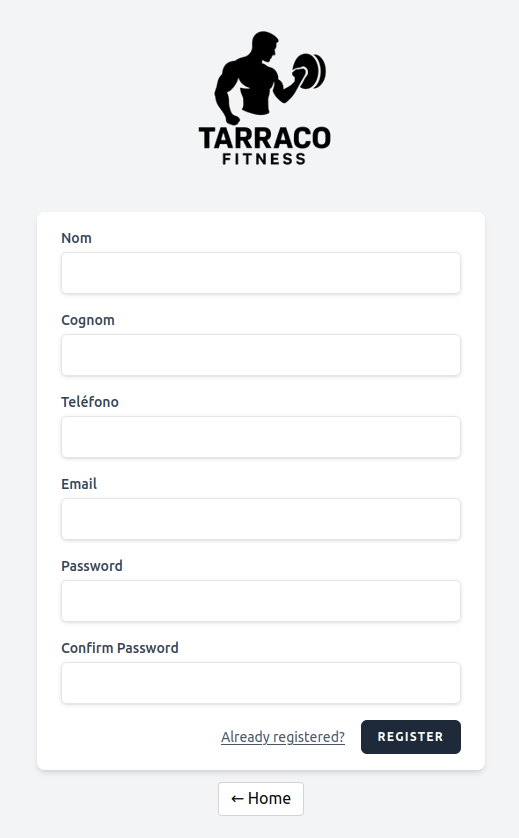
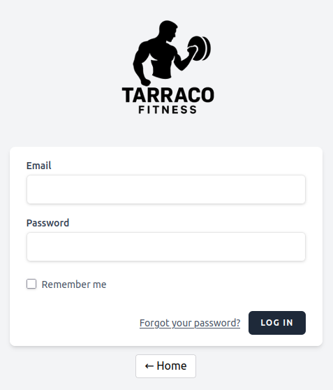
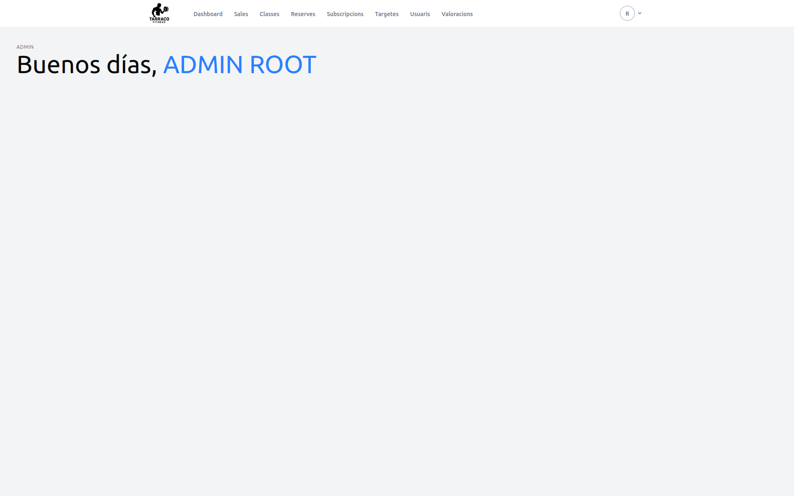
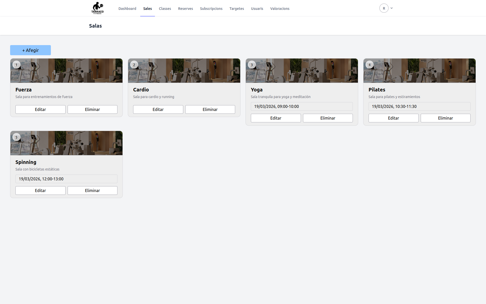
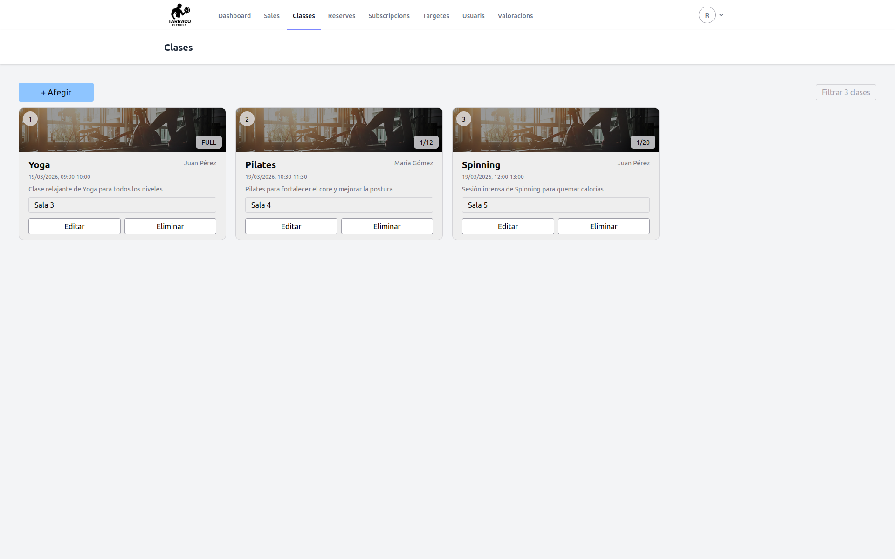
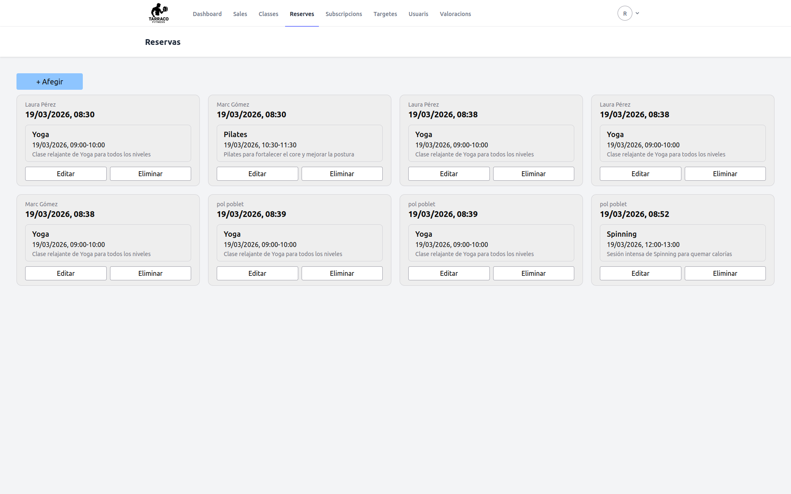
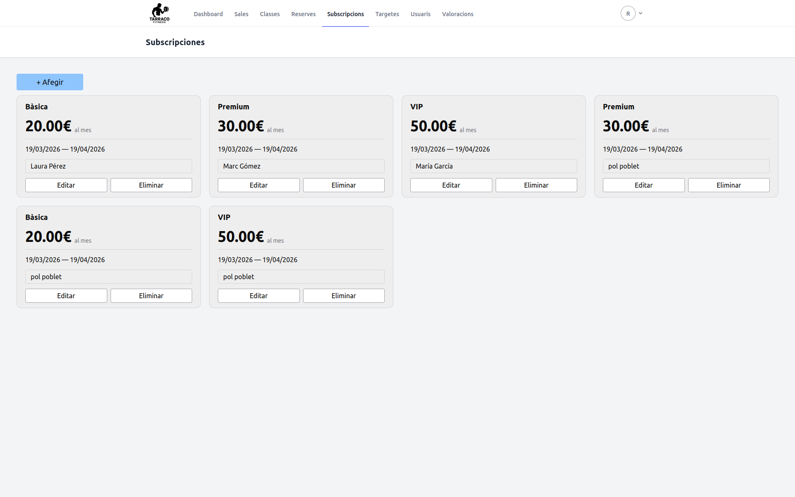
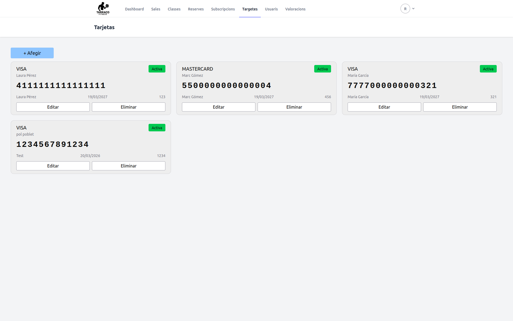
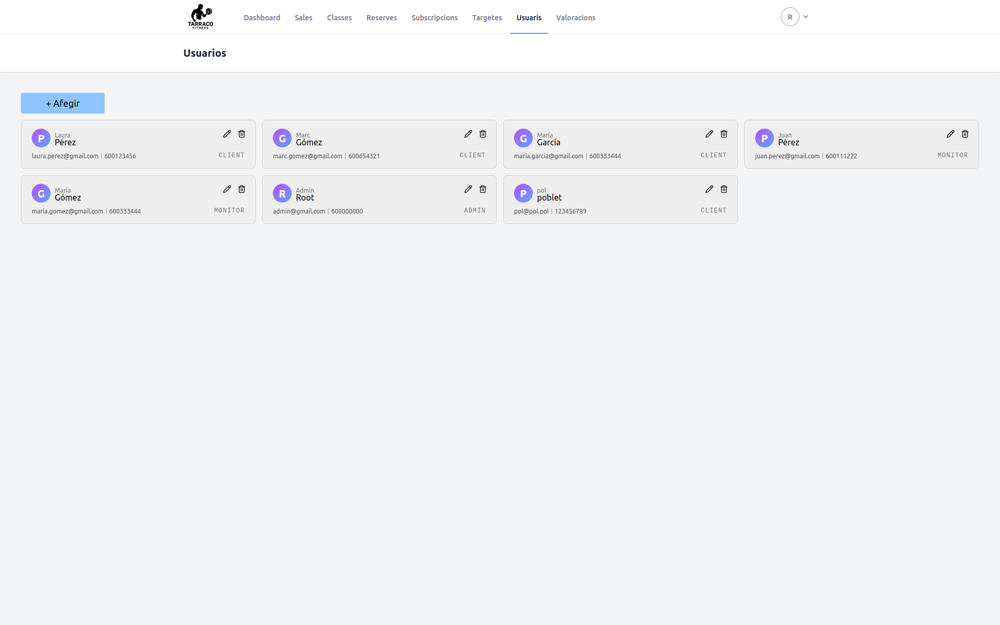

# Projecte DAW – Tarraco Fitness

## Descripció breu del projecte

Aquest projecte permet gestionar usuaris, classes, reserves, sales i valoracions dins d’un gimnàs, utilitzant Laravel 12 amb PHP 8.4, integrat amb MySQL i Docker.
Inclou tot l’entorn de desenvolupament, sense necessitat d’instal·lar PHP o MySQL localment.

## Passos per aixecar l'entorn

Comandes bàsiques si es comença des de zero:

| Comanda               | Què fa?            |
| --------------------- | ------------------ |
| `apt install make`    | Instal·la `make`   |
| `snap install docker` | Instal·la `docker` |


Segueix els següents passos per fer funcionar el projecte:

| Comanda                                                                               | Què fa?                                                                |
| ------------------------------------------------------------------------------------- | ---------------------------------------------------------------------- |
| `git clone https://gitlab.com/apaj2/modul-0613-m7.git`                                | Clona repository a màquina local                                       |
| `make composer cmd=”install”`                                                         | Instal·la dependències del Composer                                    |
| Copiar `.env.example`, canviar nom a `.env` i editar                                  | Configuració (`README_Laravel.md`)                                     |
| `make up`                                                                             | Posa en marxa dockers                                                  |
| `make art cmd=”key:generate”`                                                         | Genera clau del `.env`                                                 |
| `make npm-install`                                                                    | Instal·la                                                              |
| `make npm-build`                                                                      | Construeix                                                             |
| `make art cmd=”migrate --seed”` o `make art cmd=”migrate:fresh --seed”` (DB existent) | Genera les taules del projecte a la db noves i afegeix dades d'exemple |
| `make fix-perms`                                                                      | Dóna privilegis                                                        |

### Configuració MySQL

```
DB_CONNECTION=mysql
DB_HOST=mysql
DB_PORT=3306
DB_DATABASE=projecte
DB_USERNAME=user
DB_PASSWORD=secret

SESSION_DRIVER=file
```

## Consum d'API

La web [exercisedb.dev](https://exercisedb.dev) ens permet utilitzar dades d'exercicis, mostrar un `GIF` i més informació. També hem afegit una altra API perquè l'anterior ha deixat de funcionar. Per utilitzar-la, s'ha d'afegir les següents línies al `.env`:

```
### API principal (error 404)
API_EXERCISES=https://exercisedb.dev/api/v1/exercises
API_BODYPARTS=https://exercisedb.dev/api/v1/bodyparts
API_EQUIPMENTS=https://exercisedb.dev/api/v1/equipments
API_MUSCLES=https://exercisedb.dev/api/v1/muscles

### API secondaria
API_YUHONAS=https://raw.githubusercontent.com/yuhonas/free-exercise-db/main/dist/exercises.json
```

Per veure l'API en un entorn de prova, inicia sessió i dirigeix-te a [/exercicis](http://localhost:8001/exercicis).

## Desplegament

En el nostre cas utilitzarem [Railway]() degut a que les comandes proporcionades no ens han funcionat.

Per fer possible aquest desplegament hem fet servir la [guia](https://blog.railway.com/p/gitlab-ci-cd) oficial, on ens indica els passos a seguir:

- Crear una variable
- Afegir les variables locals (API i Railway) a les variables de GitLab

## Execució de migracions

Per obtenir les taules, hauràs d'executar la següent comanda a l'arrel del projecte:
```bash
make art cmd="migrate --seed"
```
O
```bash
make art cmd="migrate:fresh --seed"
```
> Aquesta última crea les taules de nou i genera dades d'exemple

A més, s'han canviat els noms dels arxius de migració, per facilitar la seva cerca, a `[número d'ordre d'execució]_[nom de la taula]` i separar el codi per funció, o sigui, afegir relacions, rols i més.

## Rutes o funcionalitats principals

Aquestes són les rutes usades:

- **Landing Page**. [localhost:8001](http://localhost:8001)


- **Autenticació**:
  - **Register**. [localhost:8001/register](http://localhost:8001/register)

  

  - **Login**. [localhost:8001/login](http://localhost:8001/login)

  

- **Dashboard**:



  - **Sales**. [localhost:8001/sales](http://localhost:8001/sales)

  

  - **Classes**. [localhost:8001/classes](http://localhost:8001)

  

  - **Reserves**. [localhost:8001/reserves](http://localhost:8001)

  

  - **Subscripcions**. [localhost:8001/subscripcions](http://localhost:8001/subscripcions)

  

  - **Targetes**. [localhost:8001/targetas](http://localhost:8001/targetas)

  

  - **Usuaris**. [localhost:8001/usuaris](http://localhost:8001/usuaris)

  

- **Altres**:
  - **Sobre Nosaltres**. [localhost:8001/about](http://localhost:8001/about)

  

  - **Ressenyes**. [localhost:8001/reviews](http://localhost:8001/reviews)

  

  - **Seguretat i Polítiques**. [localhost:8001/security](http://localhost:8001/security)

  
